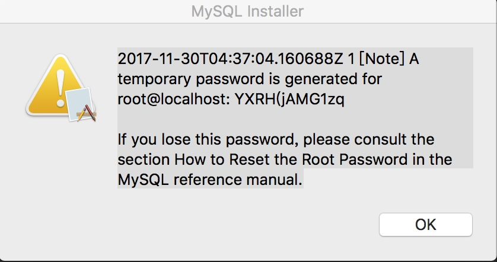
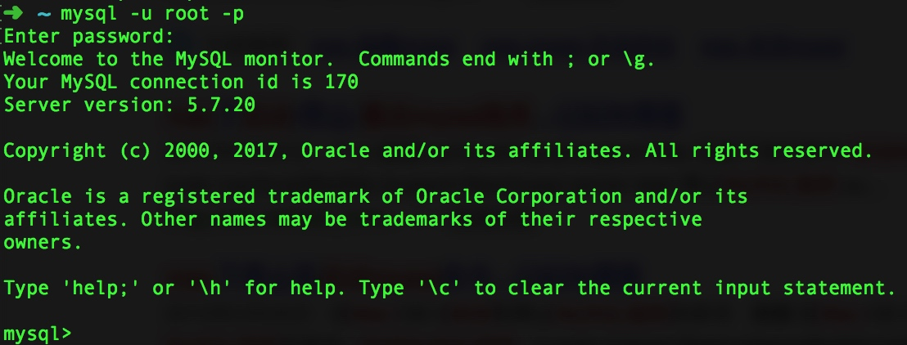

# MySQL服务启动 & 初始密码修改


## 1. MySQL服务启动

> 启动示例https://jingyan.baidu.com/article/48a42057e2b2b9a9242504a2.html

YXRH(jAMG1zq


### 1.1 环境变量修改

1. `vi .bash_profile`

2. `export MySQL_HOME=/usr/local/mysql/bin
    export PATH=${PATH}:${MySQL_HOME}`
    
3. `source .bash_profile`




## 2. 初始密码修改

>http://www.jb51.net/article/87580.htm
 
 
1.**关闭mysql服务器**
`sudo /usr/local/mysql/support-files/mysql.server stop`

也可以在系统偏好里有个MySQL里关闭。
`cd /usr/local/mysql/bin `
`sudo su` 获取权限
2. **重启服务器**
`./mysqld_safe --skip-grant-tables &` 
3. **重开个终端，**
4. **配置短命令：**
```alias mysql=/usr/local/mysql/bin/mysql`
1.进入mysql命令模式
mysql
2.进入mysql数据库
use mysql
3. 获取权限。
flush privileges; 
4. 修改密码
set password for 'root'@'localhost'=password('新密码');
5. 登录mysql
mysql -u root -p password 新密码``` 

PS：Mac操作系统下MYSQL数据库密码忘记的快速解决办法
```
1. 在系统偏好 中,中止MYSQL服务.；
2. cd/usr/local/mysql-...../bin
  sudo ./mysqld_safe--skip-grant-tables
3. 登录MySQL；
mysql
4. 置空root用户的密码； 
mysql> update mysql.user set password=‘' whereUser='root'; 
mysql> flush privileges; 
mysql> quit
5. 重新启动MySQL服务，
6. 添加密码mysql> mysqladmin -u root -p password 123    密码改为123
7. ```


## 结束mysql进程
1. `ps -A | grep mysql ` 查看mysql服务进程
2.  `su kill -9 ***` 杀掉mysql服务


