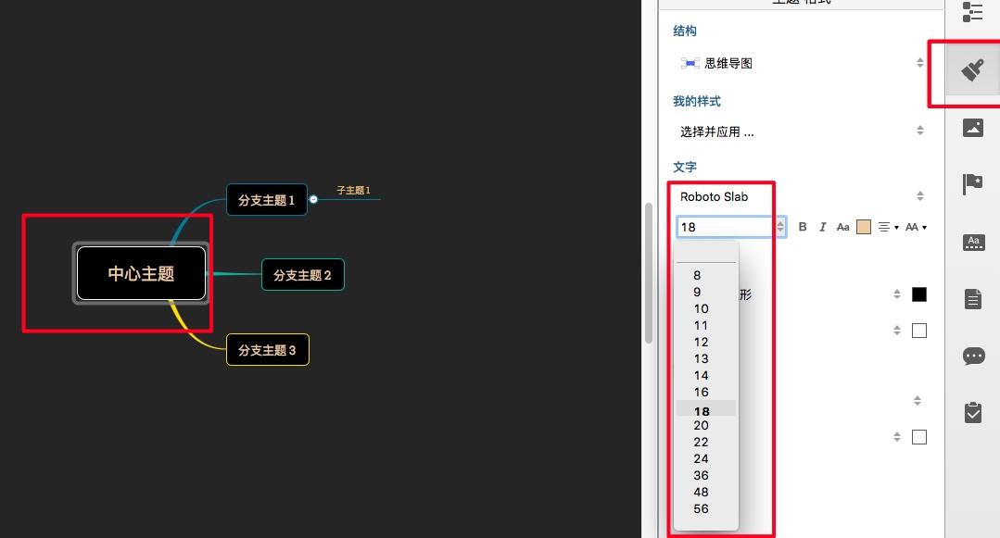
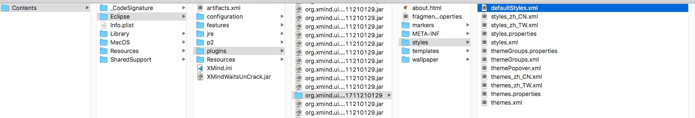
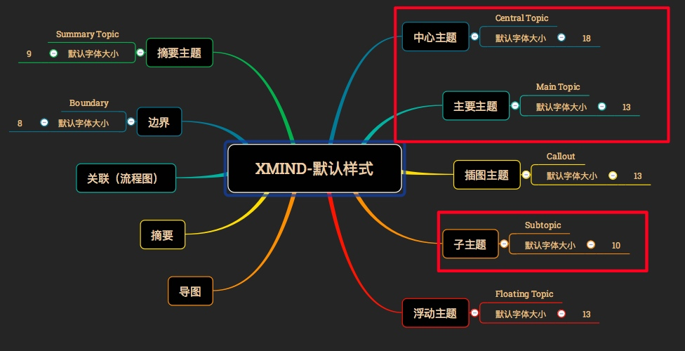
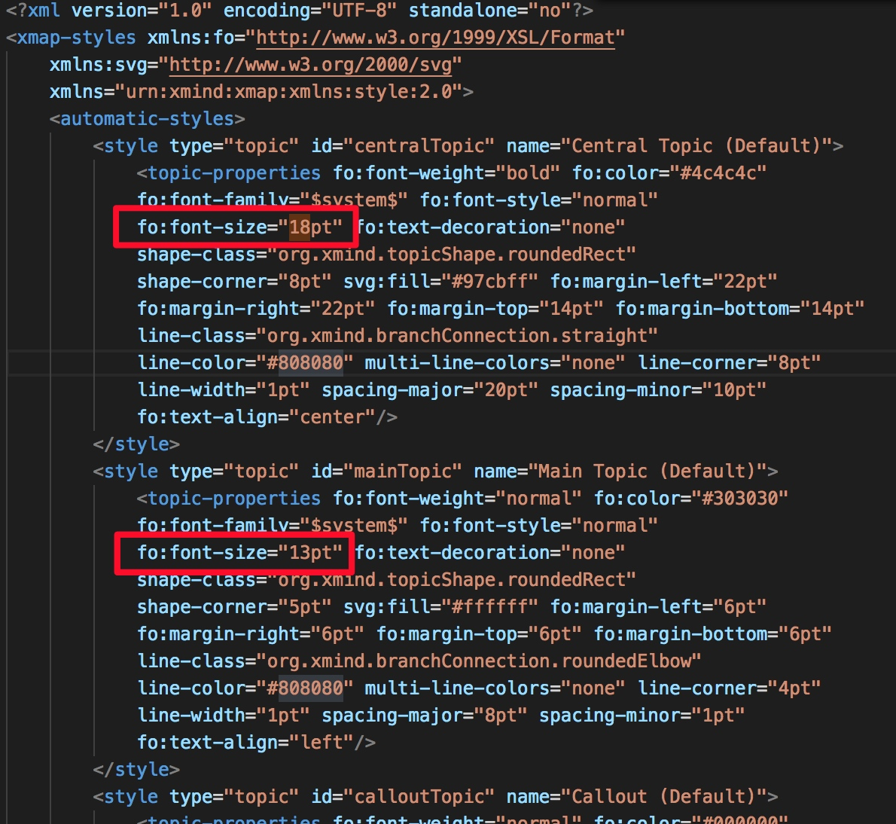

# 问题：XMind系统默认字号太小，导致导出图片较模糊
>参考：https://zhidao.baidu.com/question/2014647505141588108.html

# 解决办法
1. 通过手动设置当前XMind文件，每个层级的字体大小
2. 修改系统配置，设置默认层级大小

## 方案1：
此方法相较于方法2，较为简单，适用于只对某一文件修改。

## 方案2：
此方法适用于长期使用XMind，对导出图片清晰度有较高要求用户。
1. 找到xmind对应版本的系统样式文件地址
    `xmind8: /Applications/XMind.app/Contents/Eclipse/plugins/org.xmind.ui.resources_3.7.6.201711210129/styles`
    

2. 修改defaultStules.xml文件，修改前先备份，避免修改错误导致文件不用
其中主要需要修改的是 **中心主题，主要主题，子主题** 三种，

修改defaultStyles.xml文件中对应主题 font-size 的样式即可修改默认全局字号大小，**目前設置后所有字號大小變成了13pt，暫時還沒有找到更好的辦法。**，目前並沒有找到`xmlns="urn:xmind:xmap:xmlns:style:2.0"`這個樣式對應xml定義。有發現的朋友歡迎提供。

