# 7. 项目成本管理
## 成本管理概述
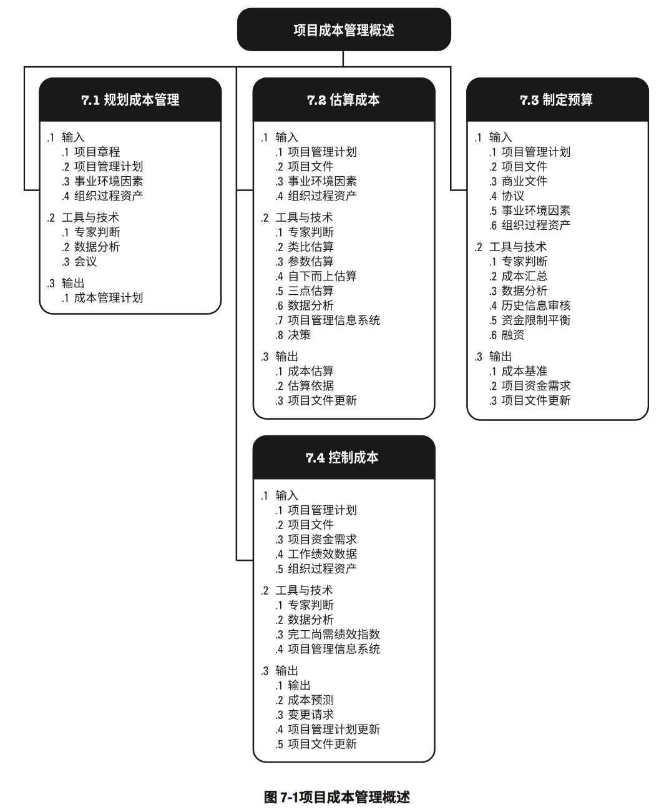

## 7.1 规划成本管理
### 规划成本管理：输入、工具与技术、输出
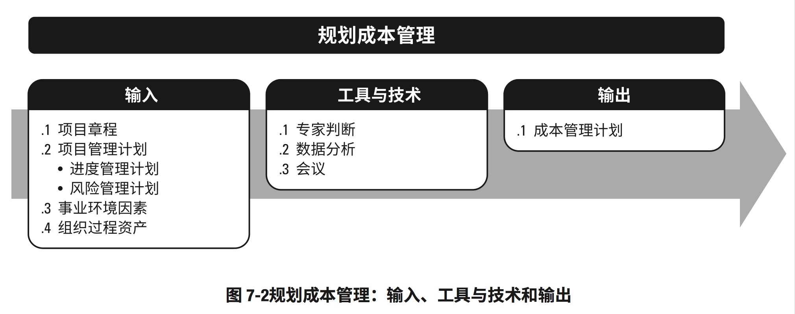

### 规划成本管理：数据流向图
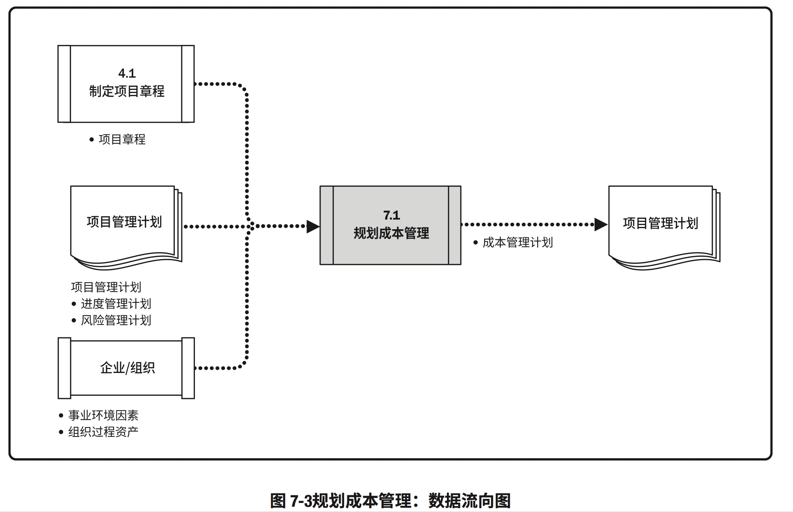

## 7.2 估算成本
### 估算成本：输入、工具与技术、输出
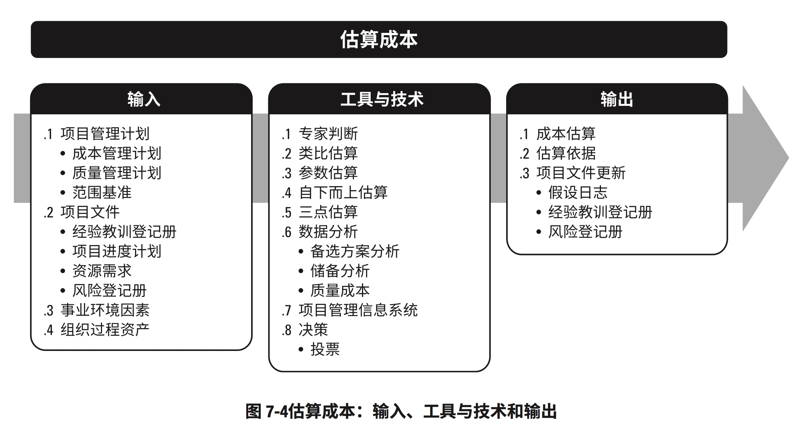

### 估算成本数据流向图
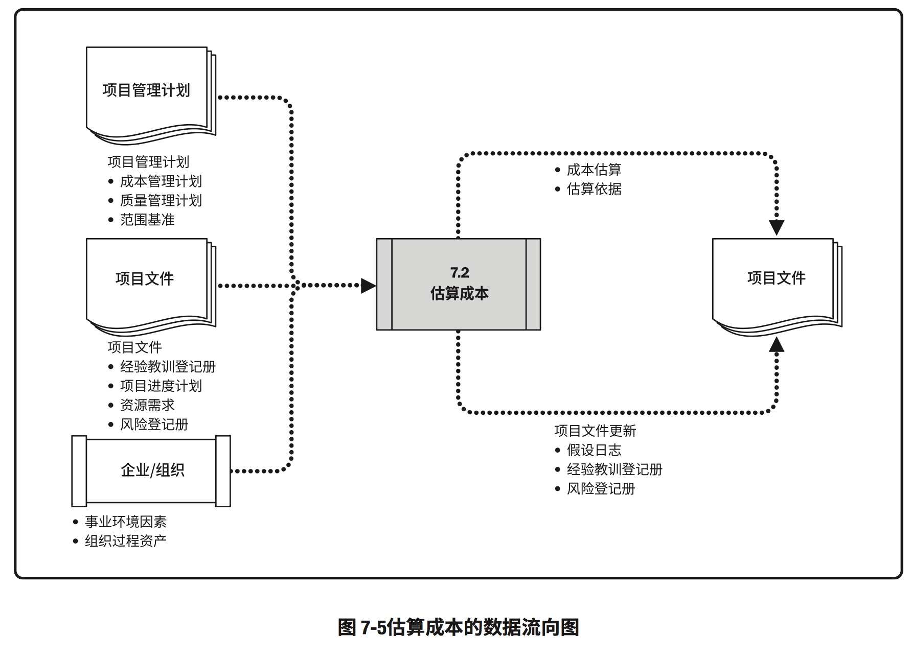

## 7.3 制定预算
### 制定预算：输入、工具与技术、输出
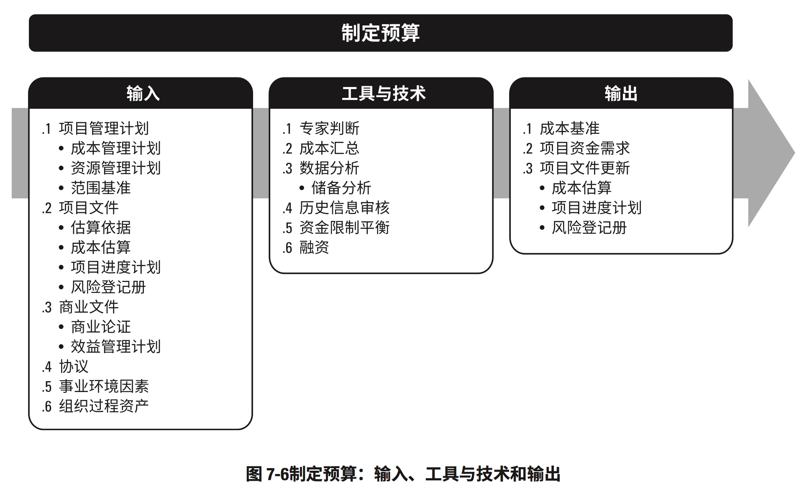

### 制定预算数据流向图
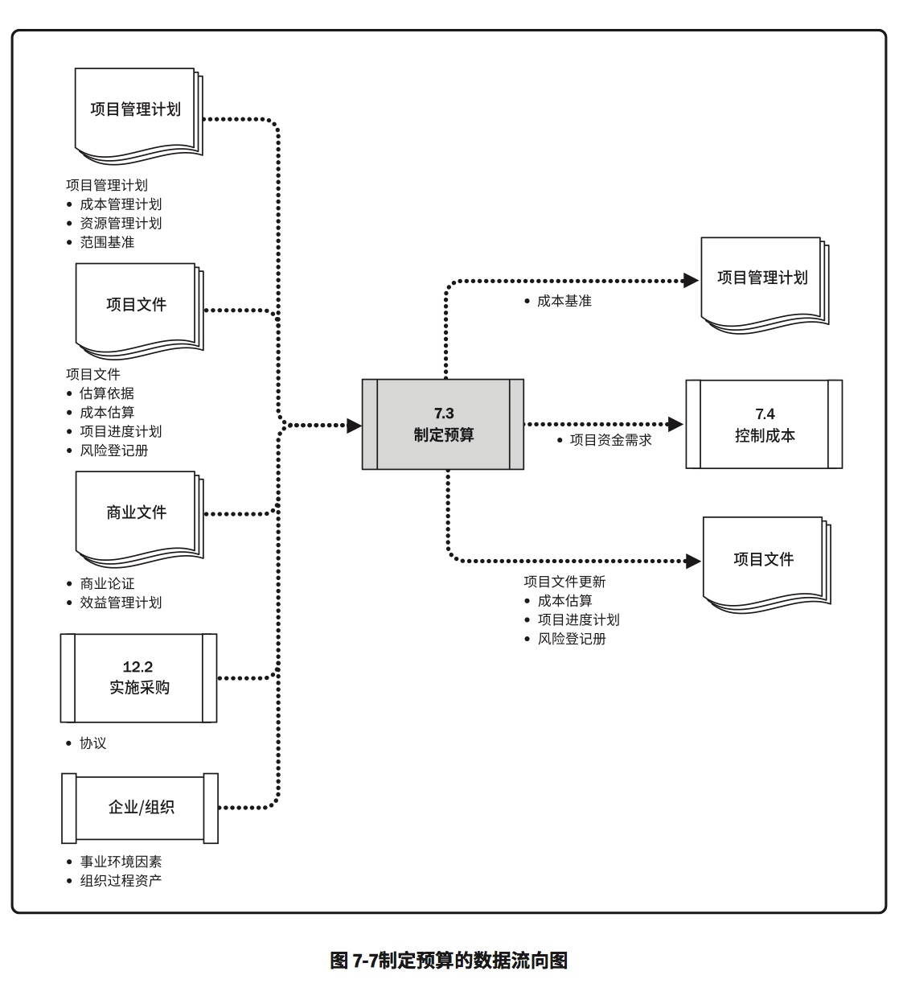

#### 制定预算：项目预算的组成
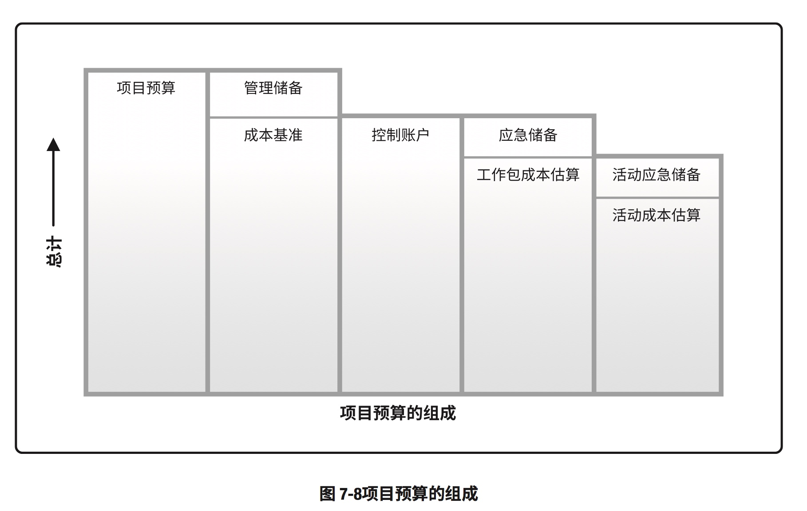

#### 制定预算：成本基准、支出与资金需求
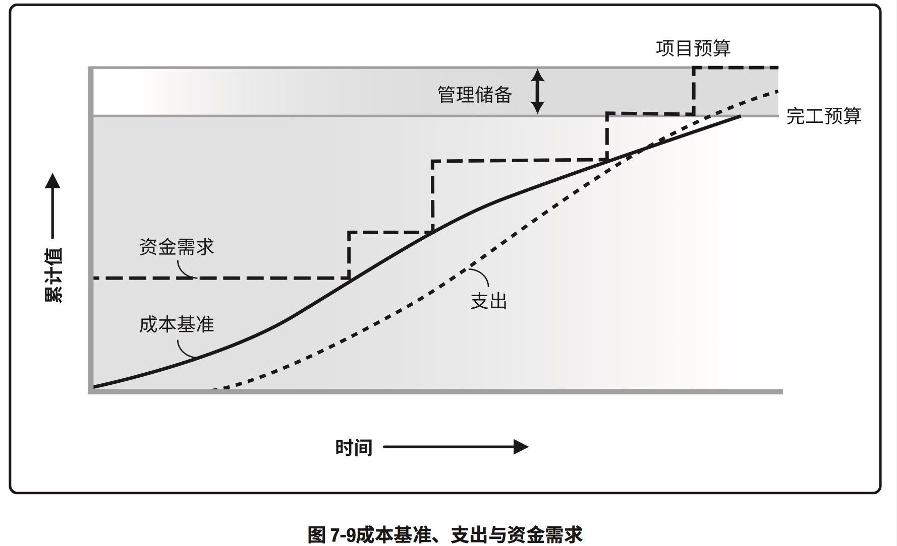

## 7.4 控制成本
### 控制成本：输入、工具与技术、输出
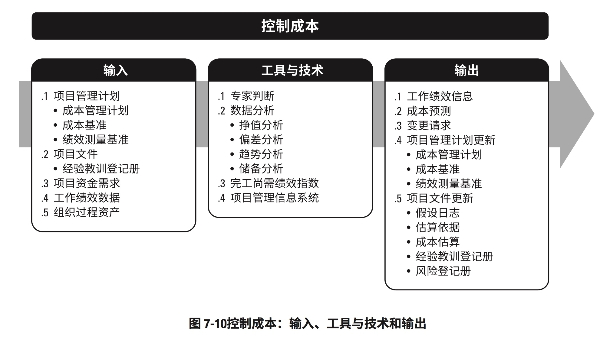

### 控制成本的数据流向图
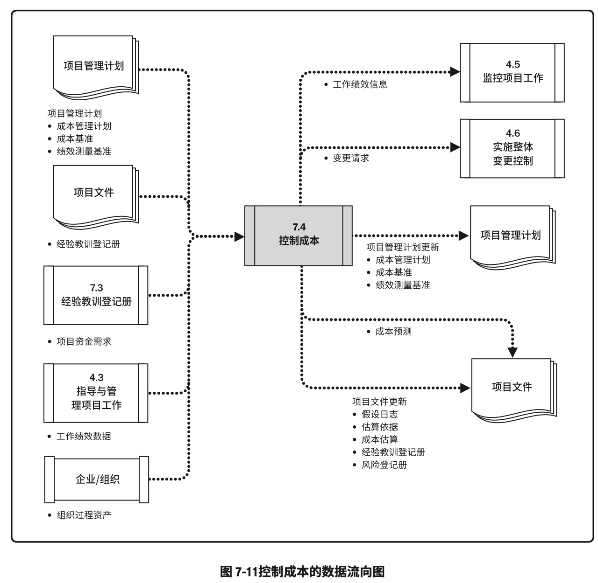

#### 控制成本：挣值、计划价值和实际成本
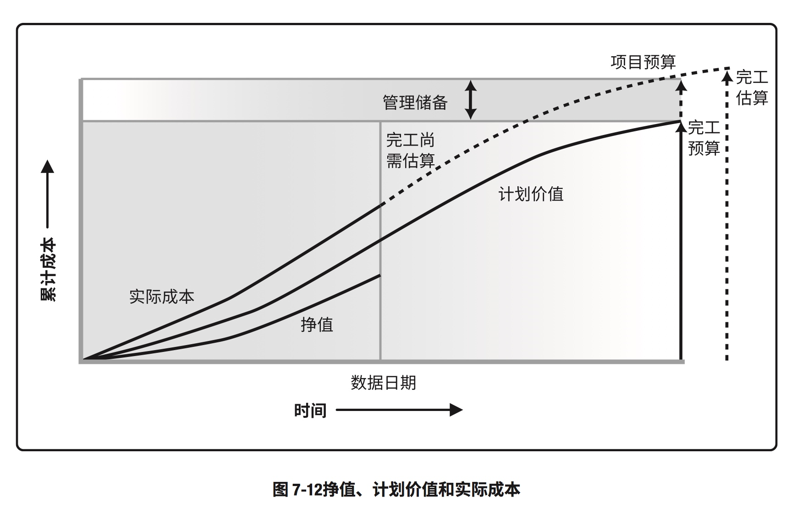

#### 控制成本：挣值计算汇总表
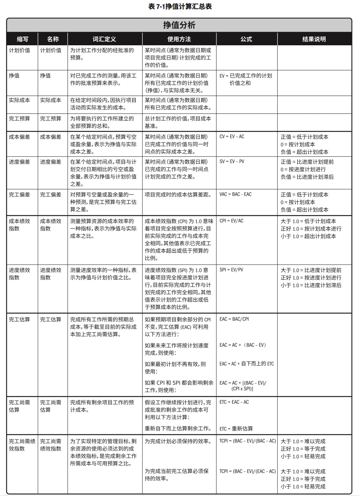

