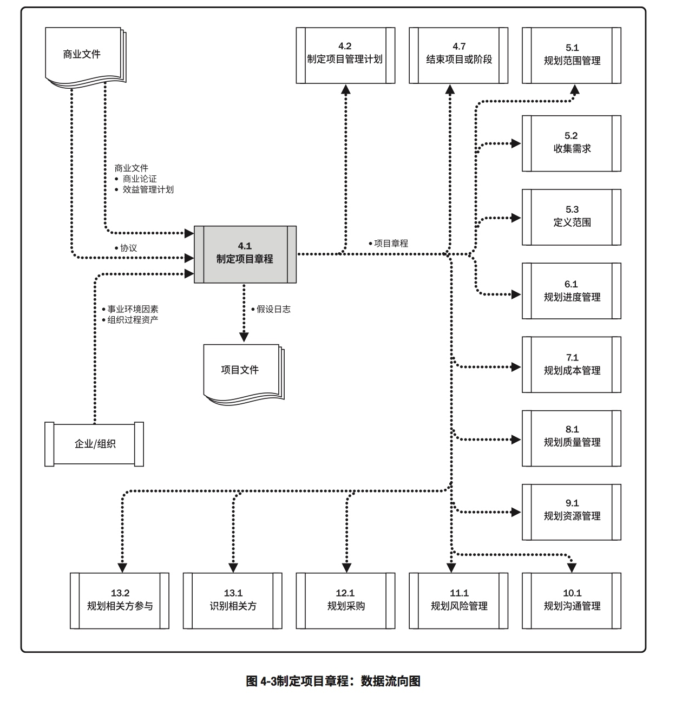
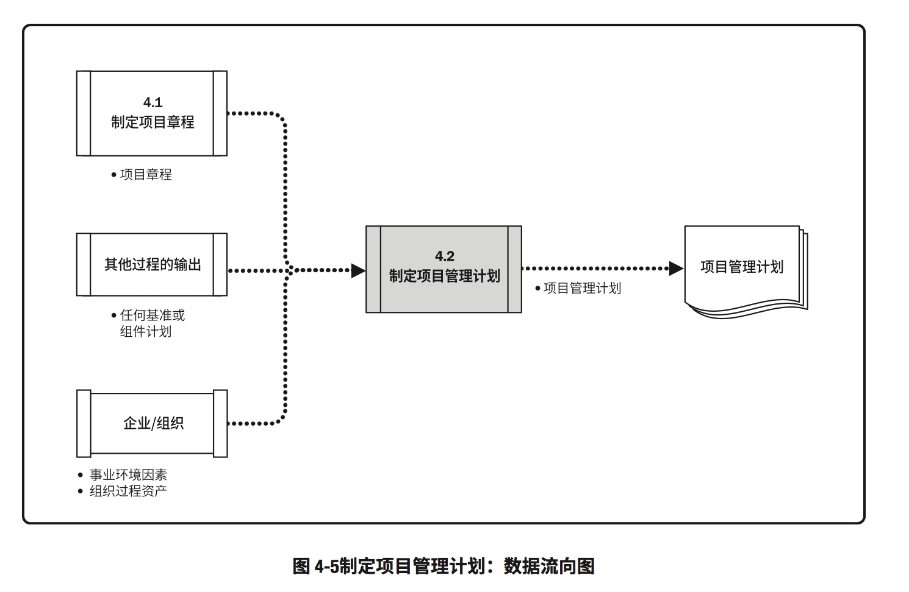

# 项目整合管理
## 4.1项目整合管理概述

## 制定项目章程

### 制定项目章程：数据流向图

## 4.2制定项目管理计划
### 制定项目管理计划：输入、工具与技术、输出

### 制定项目计划：数据流向图

### 项目管理计划和项目文件

##4.3指导与管理项目工作
###指导与管理项目工作：输入、工具与技术、输出

### 指导与管理项目流向

##4.4管理项目知识
###管理项目知识：输入、工具与技术、输出

###管理项目知识：数据流向图

##4.5监控项目工作
###监控项目工作：输入、工具与技术、输出

###监控项目工作：数据流向

##4.6实施整体变更控制
###实施整体变更控制：输入、工具与技术、输出

###实施整体变更控制：数据流向

##4.7项目结束或阶段
###结束项目或阶段：输入、工具与技术、输出

###技术项目或阶段：数据流向图

