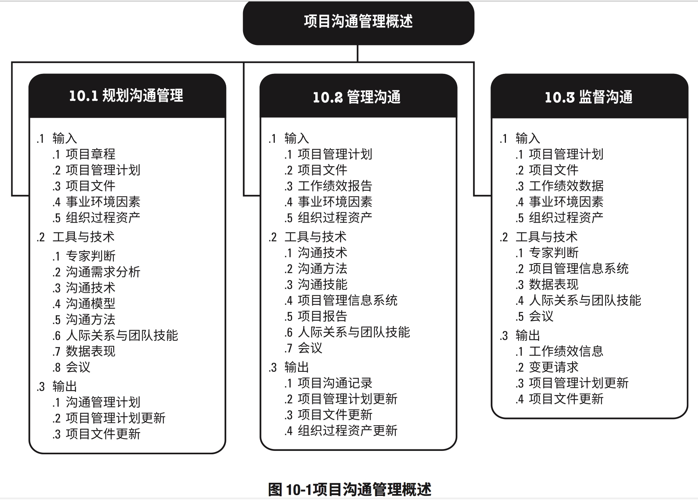
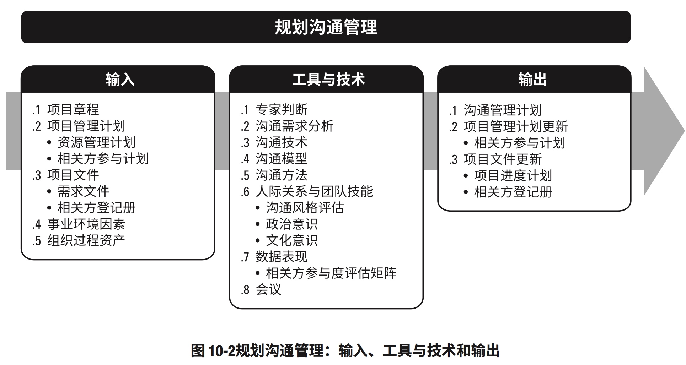
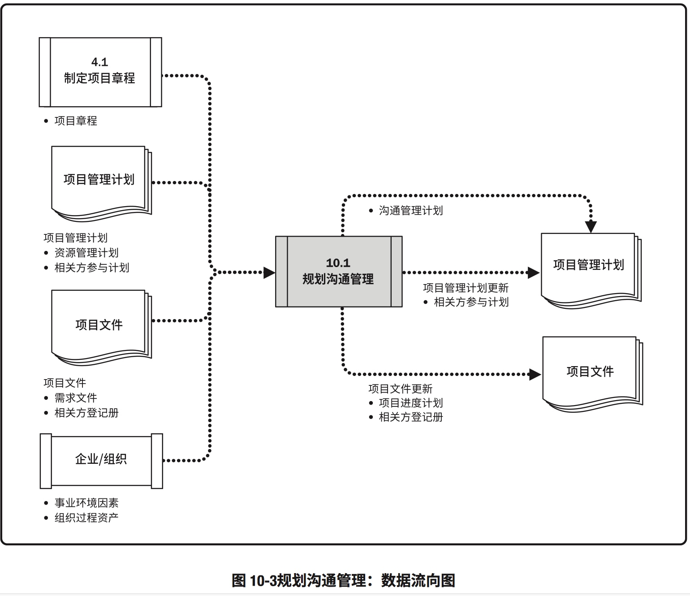
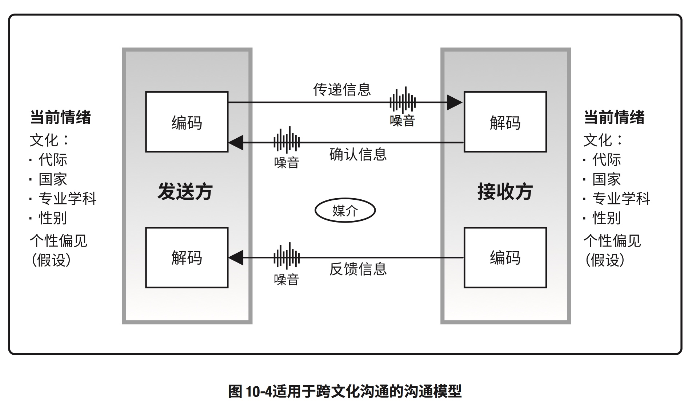
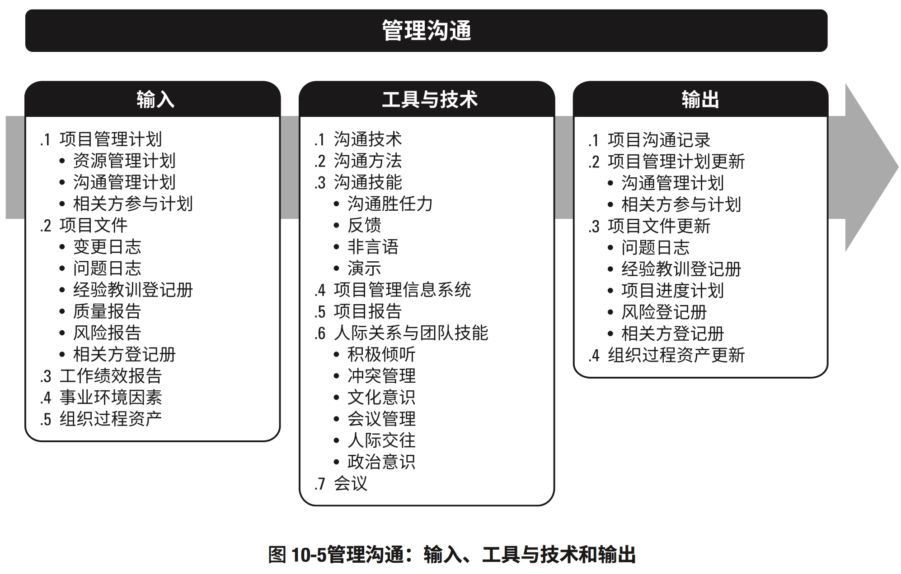
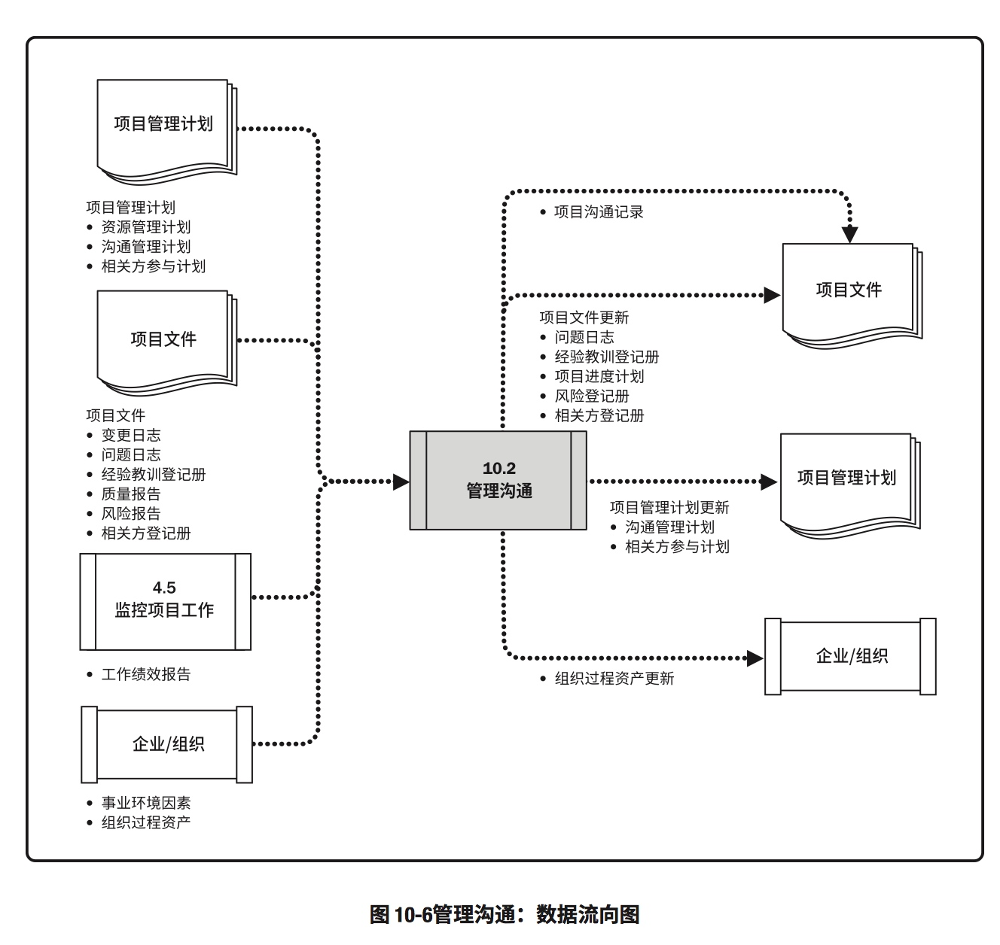
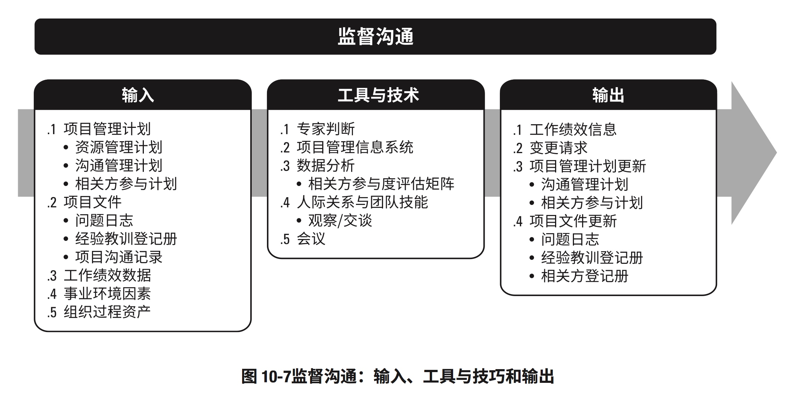
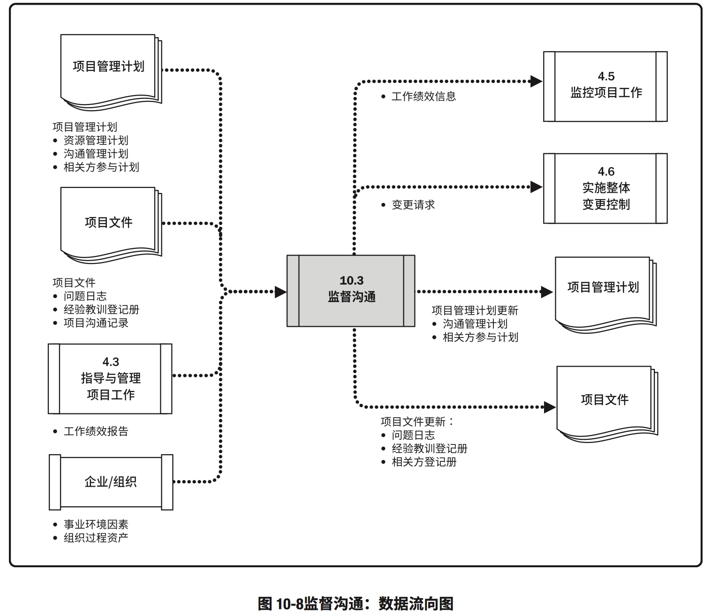

# 10. 项目沟通管理
>定义：通过开发工件，以及执行用于有效交换信息的各种活动，来确保项目及其相关方的信息需求得以满足的各个过程
>组成部分：1.制定策略，确保沟通对相关方行之有效；2.执行必要活动，以落实沟通策略

### 项目沟通管理概述

## 10.1 规划沟通管理
>定义：基于每个相关方或相关方群体的信息需求、可用的组织资产，以及具体项目的需求，为项目沟通活动能够制定恰当的方法和计划的过程
>作用：为及时想相关方提供相关信息，引导相关方有效参与项目，而编制书面沟通计划。

### 规划沟通管理：输入、工具与技术、输出

### 规划沟通管理：数据流向图

#### 跨文化沟通的沟通模型

## 10.2 管理沟通
>定义：确保项目信息及时且恰当的收集、生成、发布、存储、检索、管理、监督和最终处置的过程
>作用：促成项目团队与相关方之间的有效信息流动

### 管理沟通：输入、工具与技术、输出

### 管理沟通：数据流向图

## 10.3 监督沟通
>定义：确保满足项目及其相关方的信息需求的过程
>作用：按沟通管理计划和相关方参与计划的要求优化信息传递过程

### 监督沟通：输入、工具与技巧、输出

### 监督沟通：数据流向图

