# 9.项目资源管理
> 项目资源管理包括识别、获取和管理所需资源以成功完成项目的各个过程，这些过程有足浴确保项目尽力和项目团队在正确的时间和地点使用正确的资源

### 项目资源管理概述
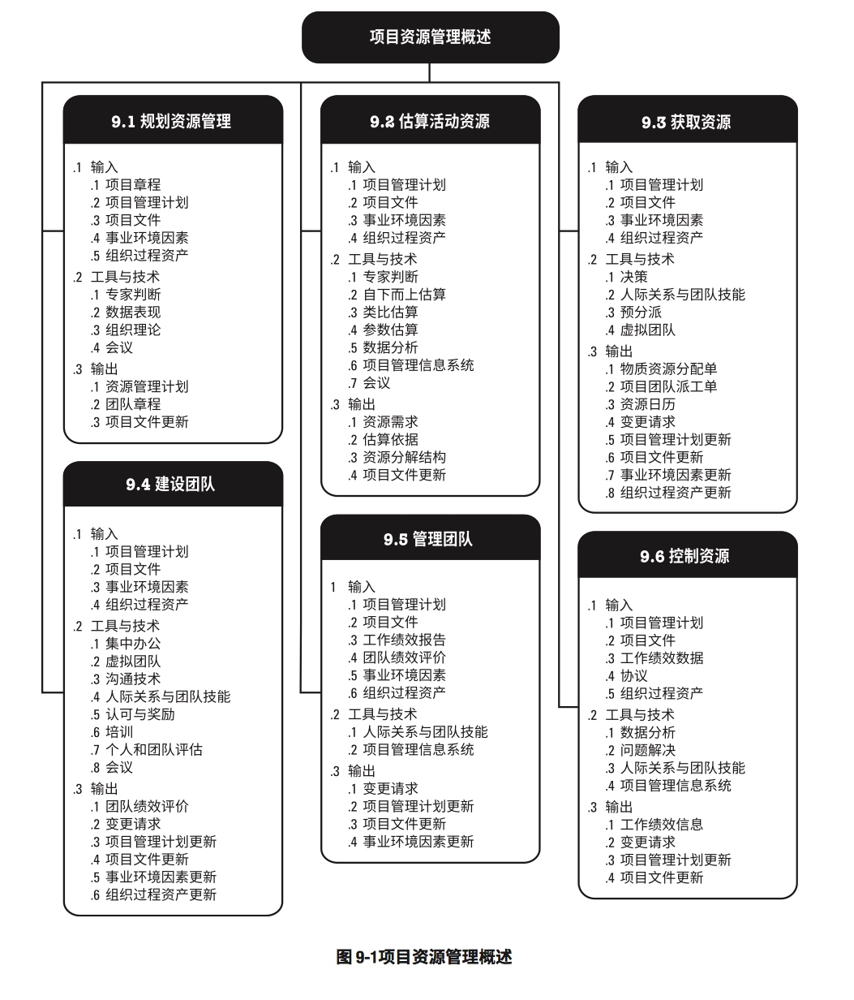

## 9.1 规划资源管理
>定义：如何估算、获取、管理和利用团队以及事务资源的过程
>作用：更具项目类型和复杂程度确定适用于项目资源的管理方法和管理程度

### 规划资源管理：输入、工具与技术、输出
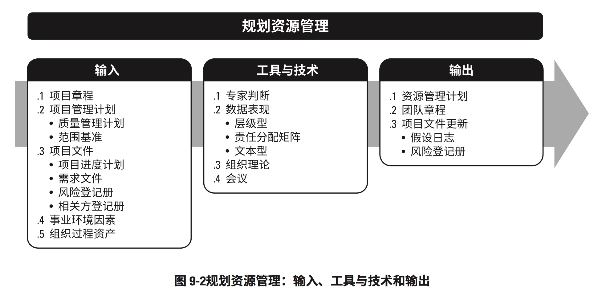

### 规划资源管理：数据流向图
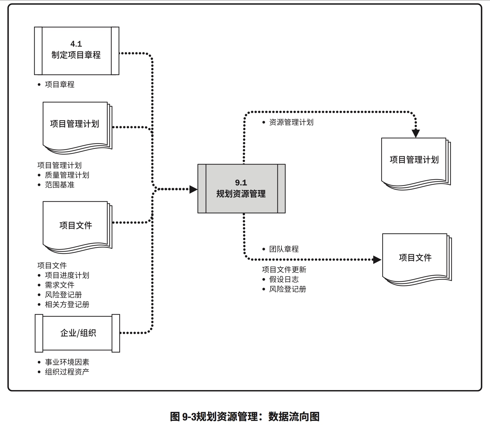

## 9.2 估算活动资源
>定义：估算执行项目所需的团资源，以及材料、设备和用品的类型和数量的过程
>作用：明确完成项目所需的资源种类、数量和特性

### 估算活动资源：输入、工具与技术、输出
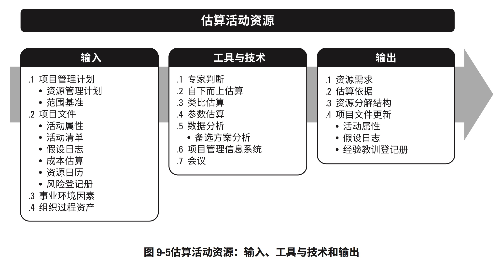

### 估算活动资源的数据流向图
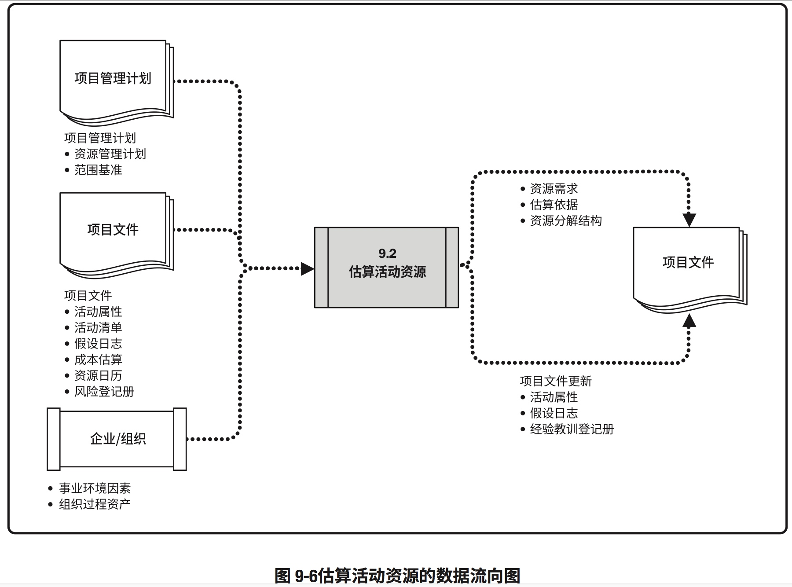

#### 资源分解结构示例
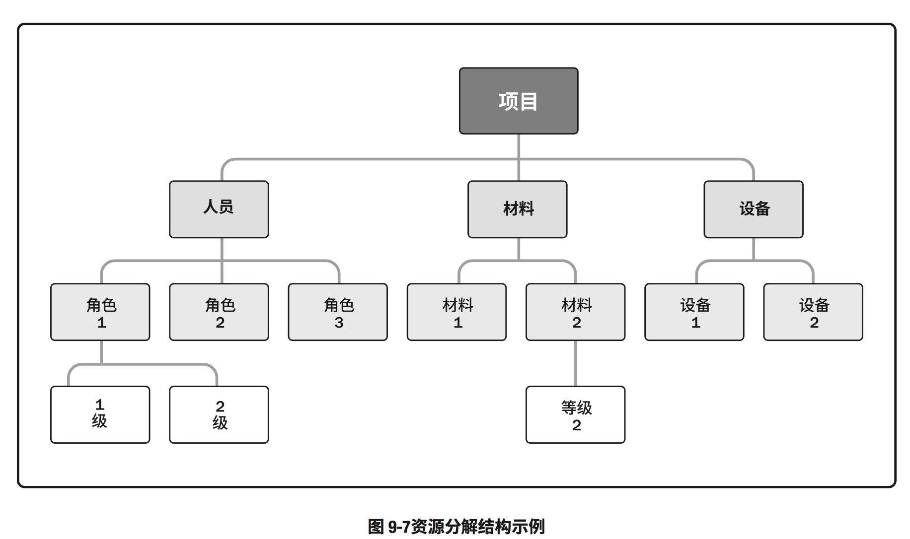

## 9.3 获取资源
>定义：获取项目所需的团队成员、设备、设施、材料、用品、和其他资源的过程
>作用：概述和指导资源的选择，并将其分配给相应的活动

### 获取资源：输入、工具与技术、输出
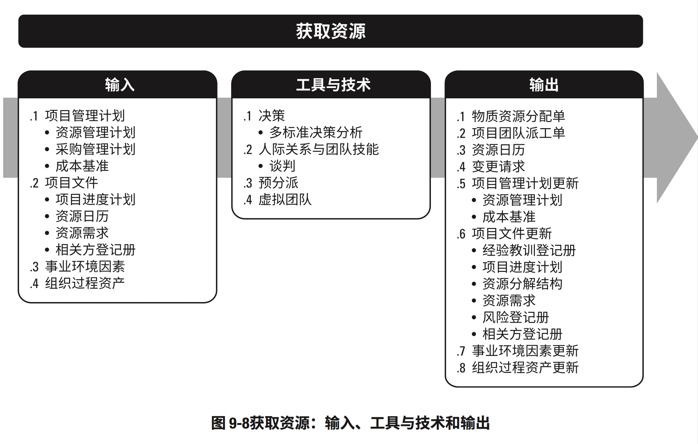

### 获取资源：数据流向图
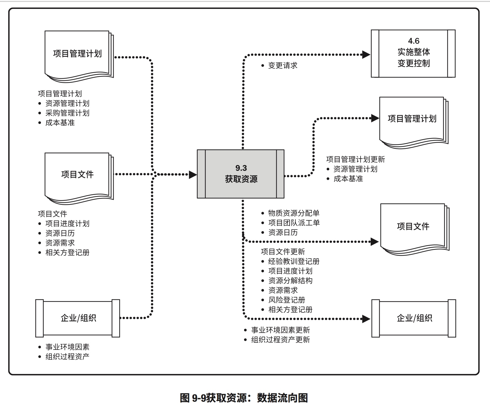

## 9.4 建设团队
>定义：提高工作能力，促进团队成员互动，改善团队整体氛围，以提高项目绩效的过程
>作用：改进团队协作，增强人际关系技能，激励员工，减少抹茶以及提升整体项目绩效

### 建设团队：输入、工具与技术、输出
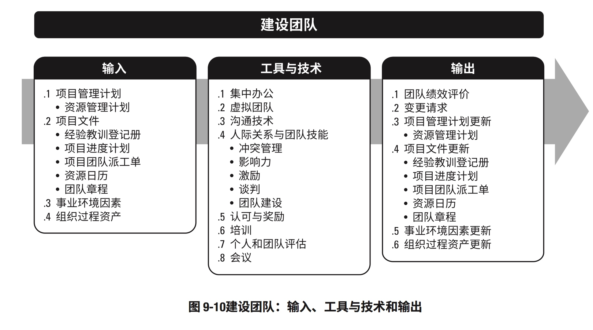

### 建设团队：数据流向图
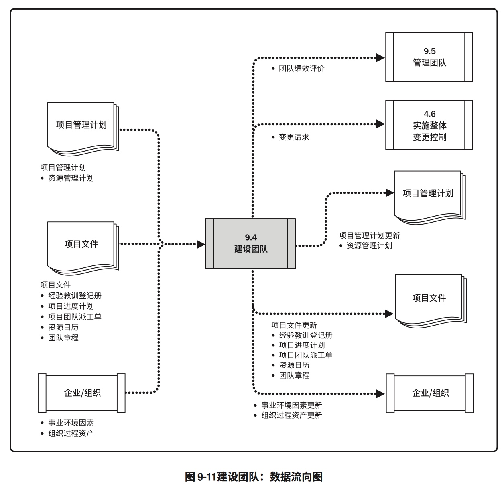

## 9.5 管理团队
>定义：跟踪团队成员工作表现，提供反馈，解决问题并管理团队变更，以优化项目绩效的过程
>作用：影响团队行为、管理冲突以及解决问题

### 管理团队：输入、工具与技术、输出
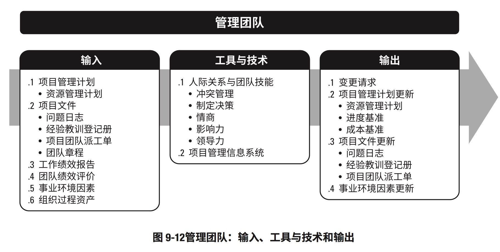

### 管理团队：数据流向图
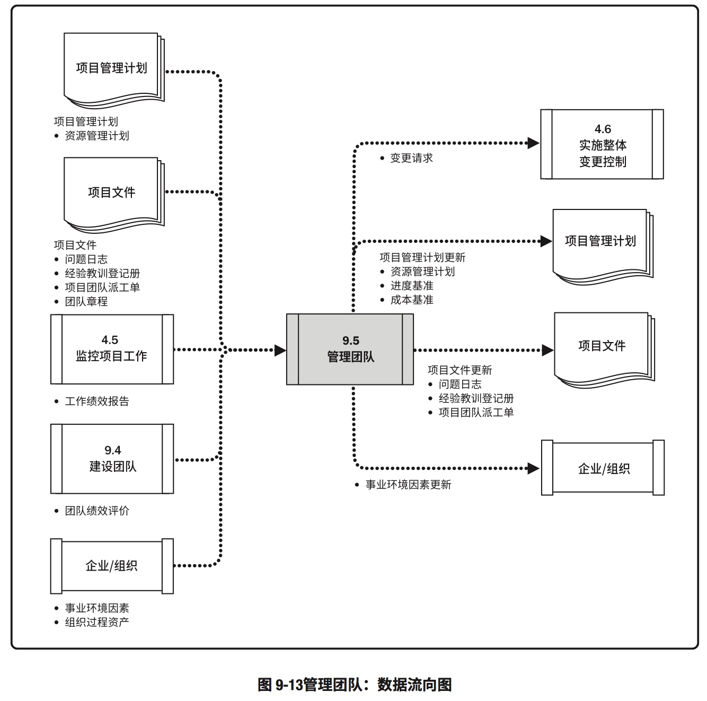

## 9.6 控制资源
>定义：确保按计划为项目分配实物资源，以及更具资源使用计划监督资源实际使用情况，并采取必要纠正措施的过程
>作用：确保所分配的资源适时适地可用于项目

### 控制资源：输入、工具和技术、输出
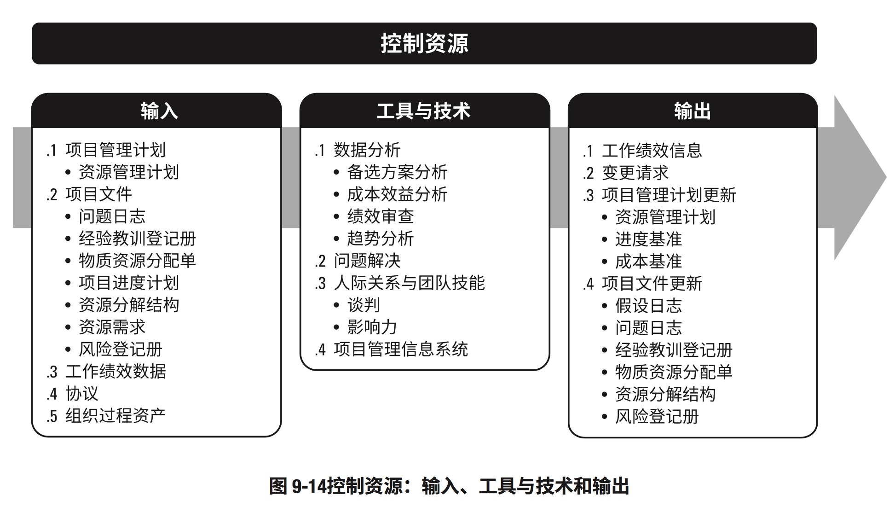

### 控制资源：数据流向图
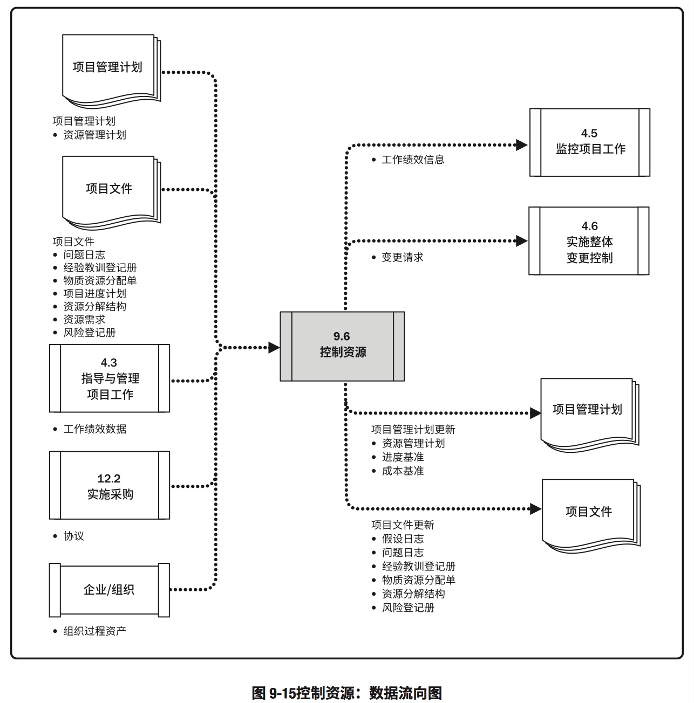

