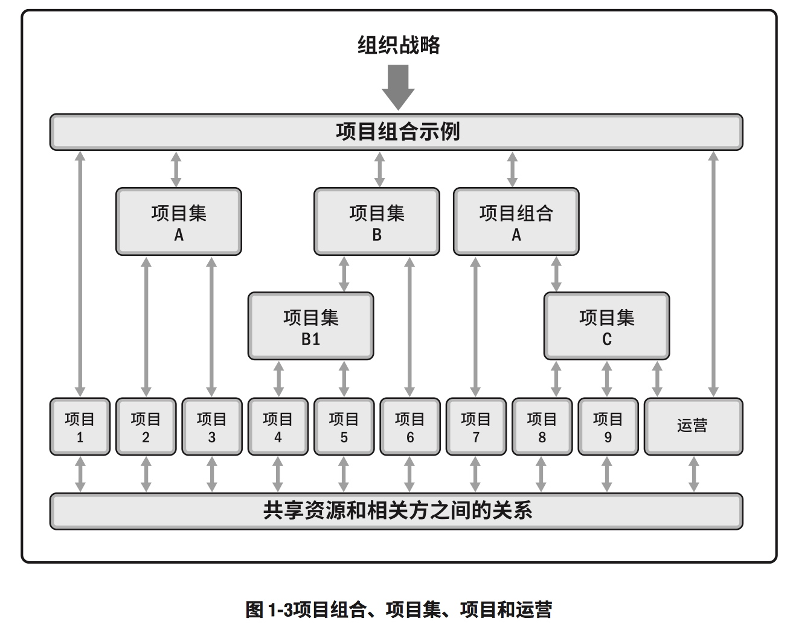
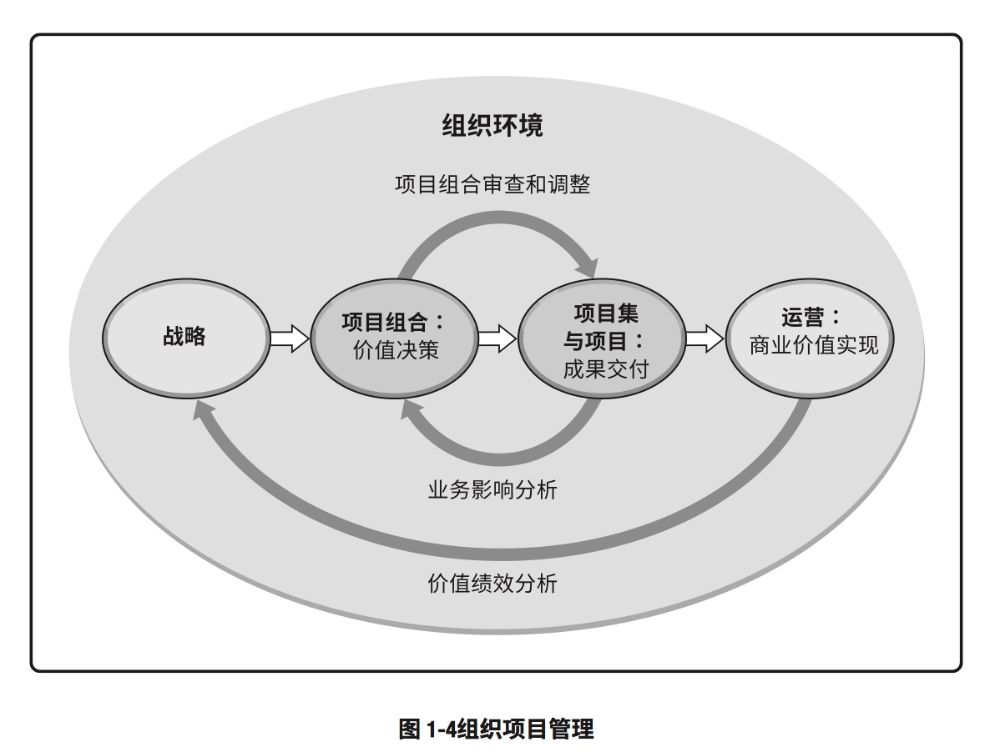
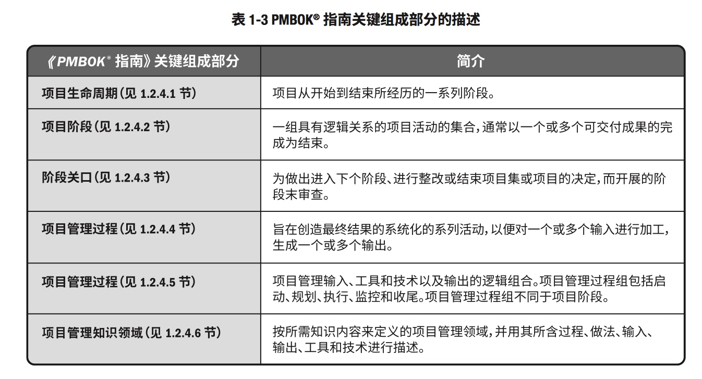
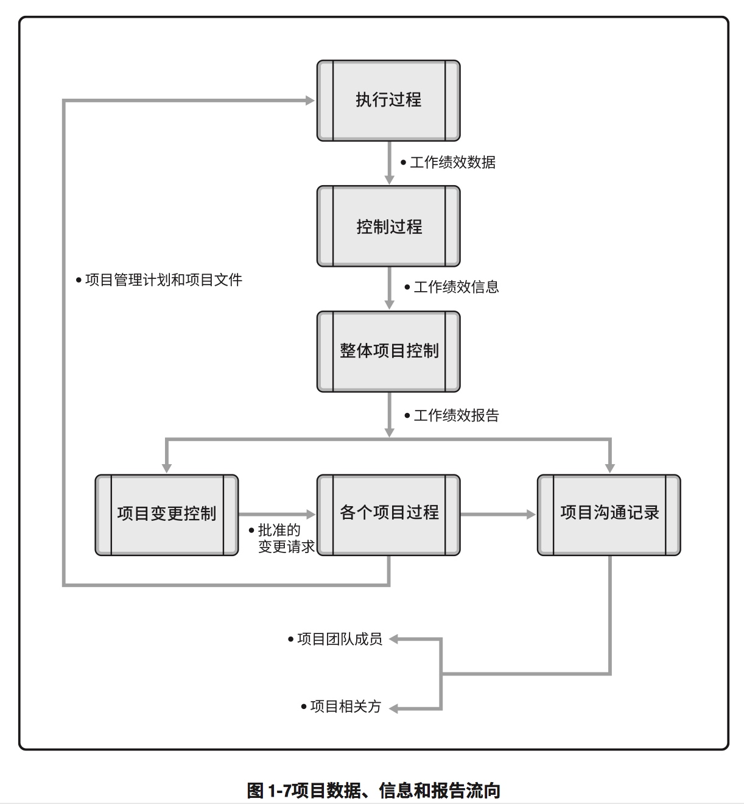
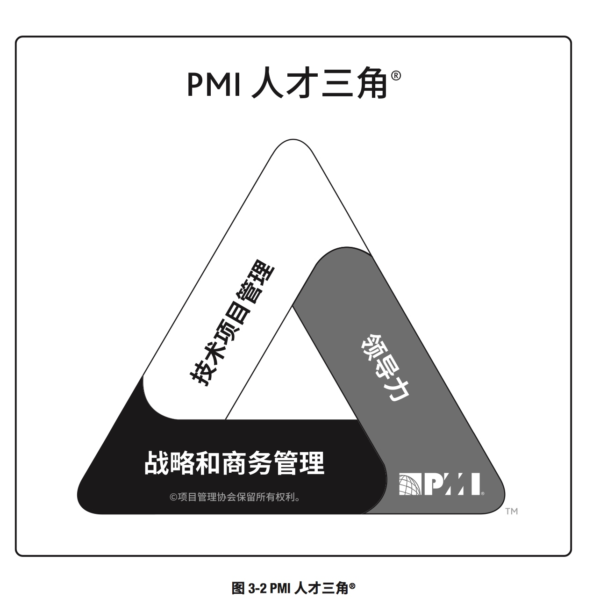

# 1. 引论

## 项目启动背景

## 项目组合、项目集、项目和运营的关系

## 项目、项目集、项目组合管理的比较概述

## 组织级项目管理和战略

##《PMBOK指南》关键组成部分

## 项目生命周期

# 2.0项目管理过程组

## 项目数据、信息和报告流向

## 需求评估与关键业务/项目文件的相互关系

# 3.0项目运行环境
## 项目影响力  

## 组织结构对项目的影响

# 项目经理的角色
## 项目经理的影响力范围

## PMI人才三角

## 团队管理与团队领导力的比较

