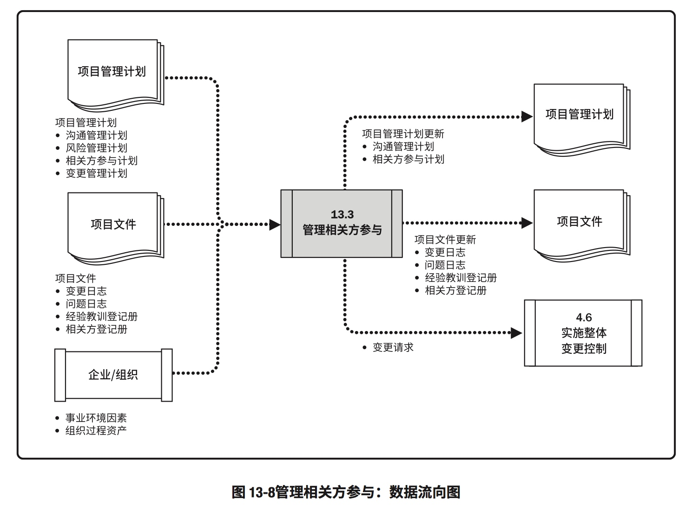

# 13. 项目相关方管理
>定义：包括用于开展下列工作的各个过程
>作用：识别能够影响项目或会受项目影响的人员、团体或组织，分析相关方对项目的期望和影响，制定合适的管理策略来有效调动相关方参与项目决策和执行。用这些过程分析相关方期望，评估他们对项目或受项目影响的程度，以及制定策略来有效引导相关方支持项目决策、规划和执行

### 项目干系人管理概述

## 13.1 识别相关方
>定义：定期识别项目相关方，分析和几率他们的利益、参与度、相互依赖性、影响力和对项目成功的潜在影响的过程
>作用：使项目团队能够建立对每个相关方或相关方群体的适度关注

### 识别相关方：输入、工具与技术、输出

### 识别相关方：数据流向图

## 13.2 规划相关方参与
>定义：根据相关方的需求、期望、利益和对项目的潜在影响，制定项目相关方参与项目的方法的过程
>作用：提供与相关方惊醒有效互动的可行计划

### 规划相关方参与：输入、工具和技术、输出

### 规划相关方参与：数据流向图

## 13.3 管理相关方参与
>定义：与相关方进行沟通和协作以满足其需求与期望、处理问题，并促使相关方合理参与的过程
>作用：让项目经理能够提高相关方的支持，并尽可能降低相关方的地址

### 管理相关方参与：输入、工具与技术、输出

### 管理相关方参与：数据流向图

## 13.4 监督相关方参与
>定义：监督项目相关方关系，并通过修订参与策略和计划来引导相关方合理参与项目的过程
>作用：随着项目进展和环境变化，维持或提升相关方参与活动的效率和效果

### 监督相关方参与：输入、工具与技术、输出

### 监督相关方参与：数据流向图

