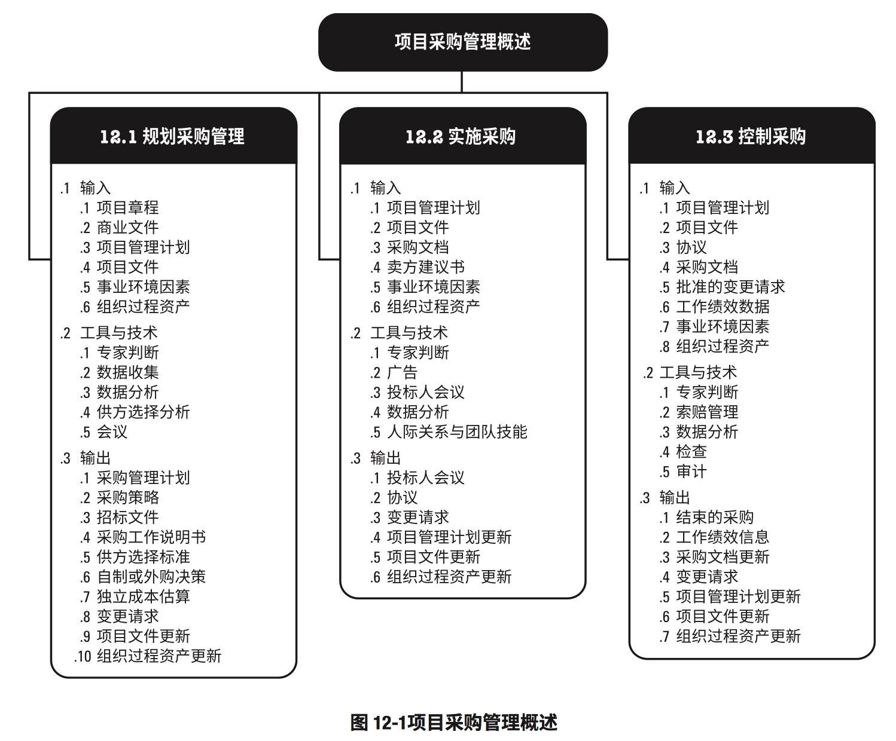
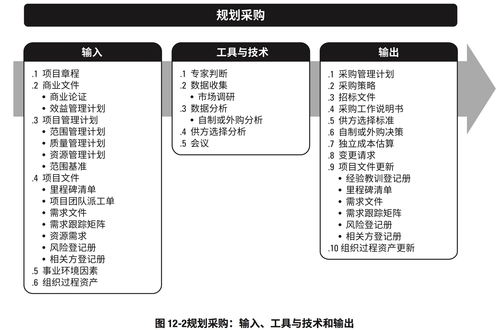
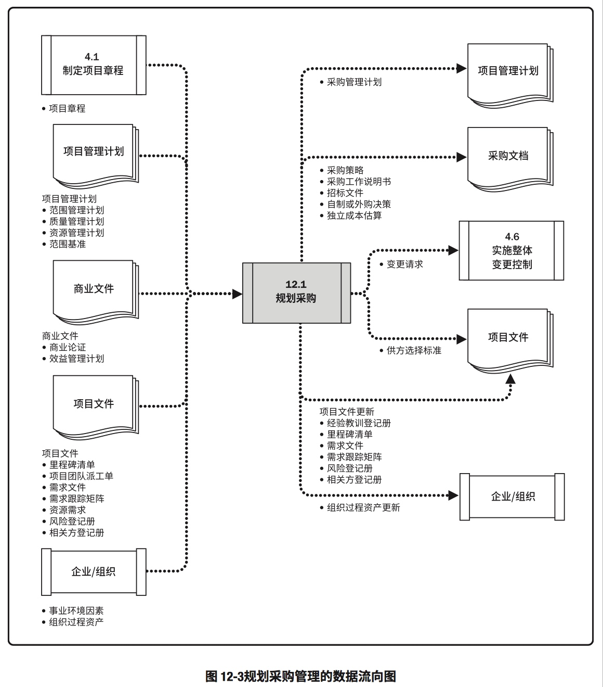
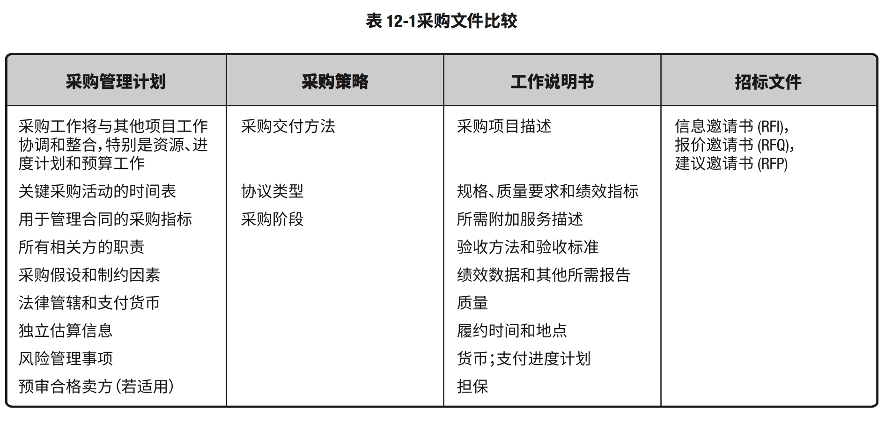
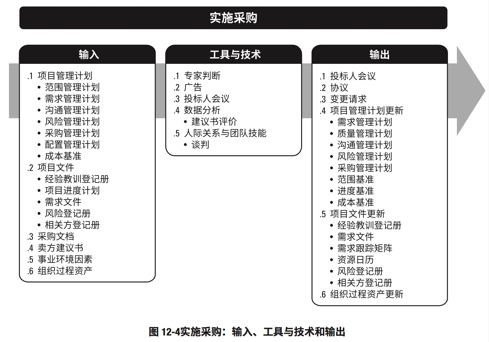
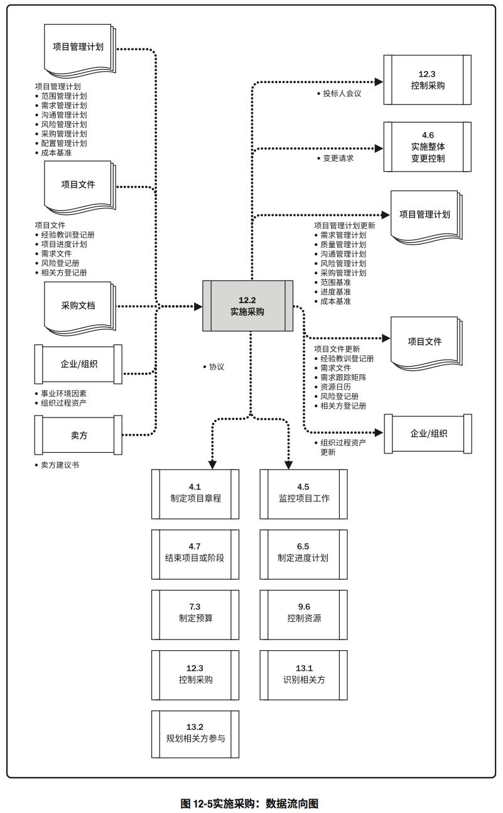
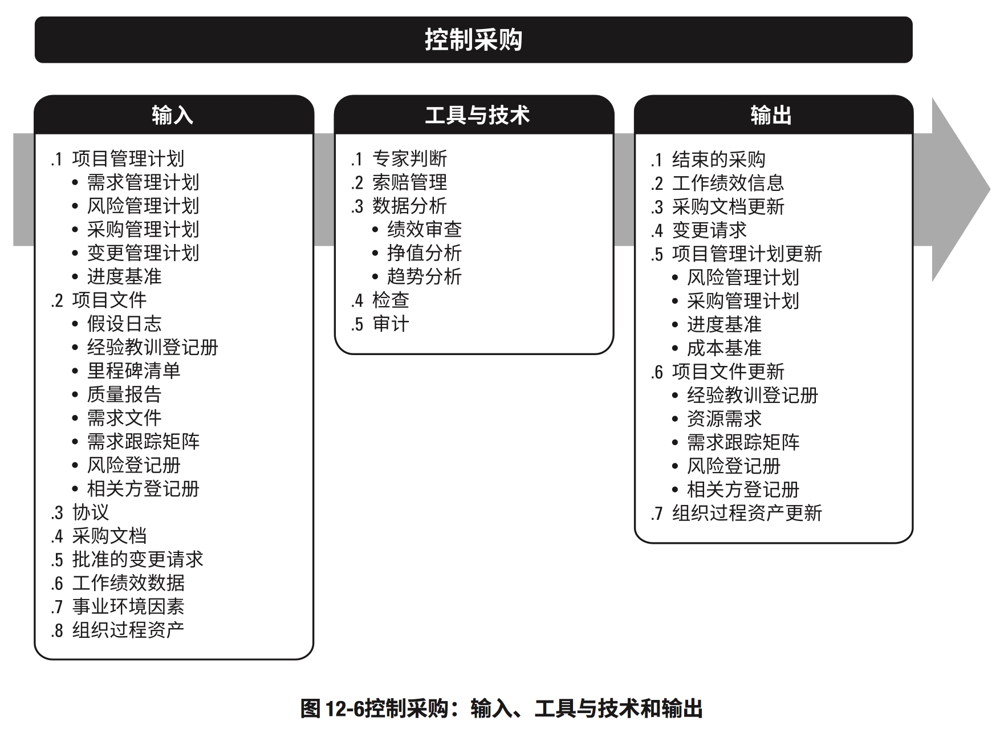
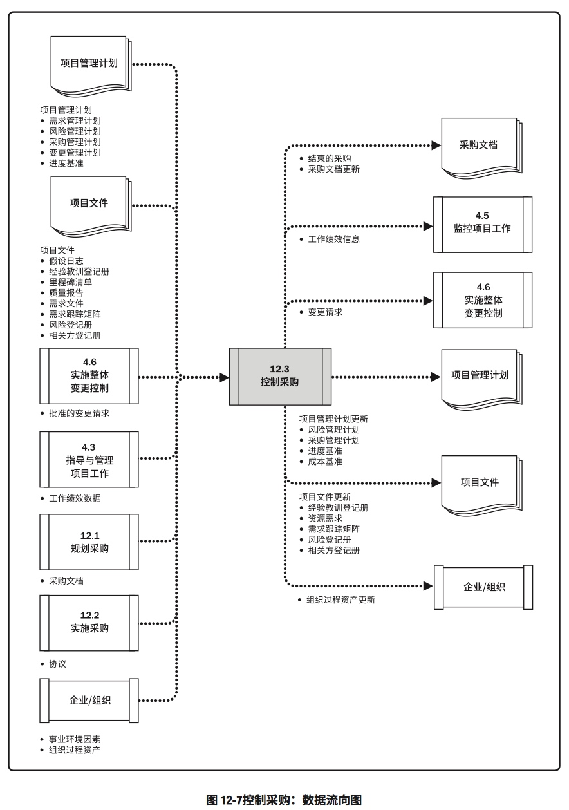

# 12. 项目采购管理
>定义：包括从项目团队外部采购或获取所需产品、服务或成果的各个过程

### 项目采购管理概述

##12.1 规划采购管理
>定义：记录项目采购决策、明确采购方法，及识别潜在卖方的过程
>作用：确定是否从项目外部获取货物和服务，如果是，则还要确定在什么时间、以什么方式获取什么货物和服务

### 规划采购：输入、工具与技术、输出

### 规划采购管理的数据流向图

#### 采购文件比较

## 12.2 实施采购
>定义：获取卖方应答、选择卖方并授予合同的过程
>作用：选定合格卖方并签署关于货物或服务交付的法律协议

### 实施采购：输入、工具和技术、输出

### 实施采购：数据流向图

## 12.3 控制采购
> 定义：管理采购关系，监督和统计小，实施必要的变更和纠偏，以及关闭合同的过程
> 作用：确保买卖双方履行法律协议，满足项目需求

### 控制采购：输入、工具与技术、输出

### 控制采购：数据流向图

