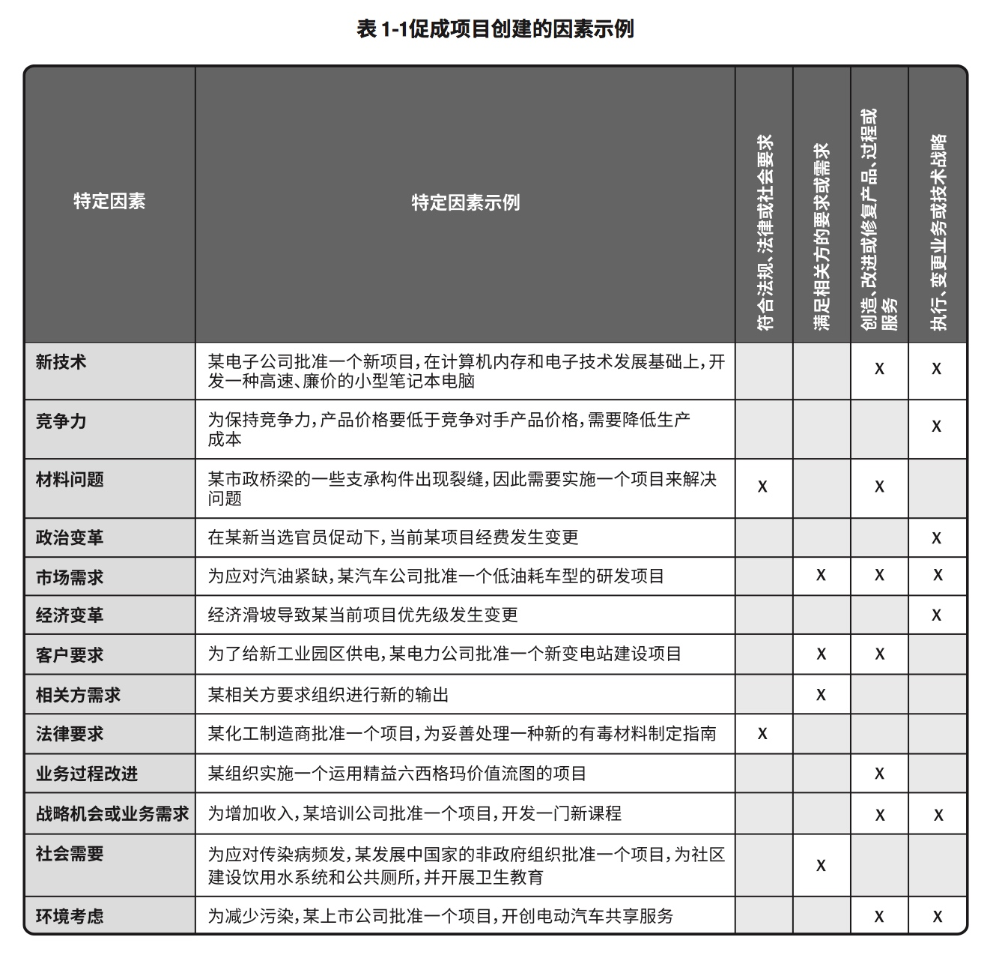

# 1. 引论
## 项目
>定义：是为创造独特的产品、服务或成果而进行的临时性工作
>作用：实现项目目标可能会产生一个或多个可交付成果

## 1.2 基本要素
### 项目启动背景

#### 促成项目创建的因素示例

## 1.2.2 项目管理的重要性
>定义：项目管理就是将知识、技能、工具与技术应用于项目活动，以满足项目的要求
>作用：项目管理通过合理运用于整合特定项目所需的项目管理过程得以实现，使组织能够有效且高效的开展项目，从而持续创造商业价值

### 项目组合、项目集、项目和运营的关系

### 项目、项目集、项目组合管理的比较概述

### 组织级项目管理和战略

###《PMBOK指南》关键组成部分

### 项目生命周期

#  项目管理过程组与知识领域

### 项目数据、信息和报告流向

### 需求评估与关键业务/项目文件的相互关系

# 2. 项目运行环境
## 2.1 概述
> 定义：项目所处的环境可能对项目的开展产生有利或不利的影响，这些影响的两大主要来源为**事业环境因素（EEE）和组织过程资产（OPA）**

### 项目影响力  

### 组织结构对项目的影响

### 项目管理办办公室（PMO）
>定义：项目管理办公司（PMO）是对与项目相关的治理过程进行标准化，并促进资源、方法论、工具和技术共享的一个组织结构
>类型：PMO的几种不同类型，**支持型、控制型、指令型**

# 3. 项目经理的角色
>定义：项目经理的角色不同于只能经理或运营经理。
>1. 职能经理专注于对某个职能领域或业务部门的管理监督
>2. 运营经理负责保证业务运营的高效性
>3. 项目经理是有执行组织委派，领导团队实现项目目标的个人

### 3.3 项目经理的影响力范围

### 3.4 PMI人才三角

#### 团队管理与团队领导力的比较

### 3.5 执行整合
>作用：在过程层面、在认知层面、在背景层面，经行整合
>复杂性：系统行为，人类行为，不明确性

