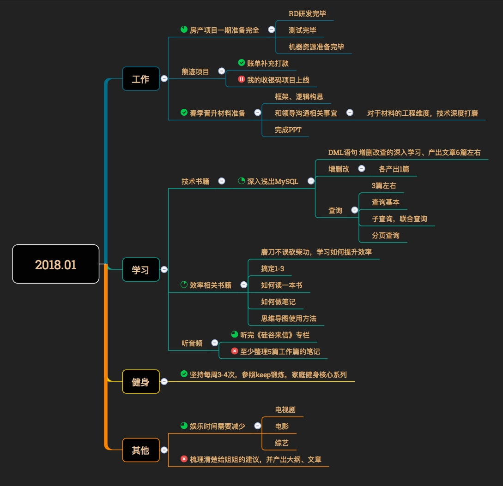

# 目录
# 1. 2018年1月
## 1.1 每月计划
####【计划概览】

## 1.2 每月小结
####【工作】
1. 房产项目
    1. 整体上按照正常节奏进行开发，测试，未出现严重的因为研发或者其他突发事项导致项目延期的问题。
    2. 由于C端属于个项目方的枢纽，将各业务数据整合，统一输出到C端，项目涉及对接到B端商户中心，检索端，认证端；细节问题很多，在研发过程中需要经常核对MRD，**部分字段与MRD上不一致**，或则缺少的情况时有发生；需要反复的校对，比较锻炼耐心；当时的方案是**统一核对必选字段的方式**极大的减少了反复核对的问题。
    3. 在项目进行中，**每日TODOList梳理的方式**，极大的明确了每天需要做的事情，让每天的工作条理清晰；在完成日常研发任务，任务分工，应对日常突发事件上，有了较大的弹性事件；项目联调、集成测试阶段，**每日站会**的方式，也较好的解决了沟通上不顺畅的问题，快速的定位和明确问题，找到解决方案
2.  

####【学习】
####【健身】
####【其他】

