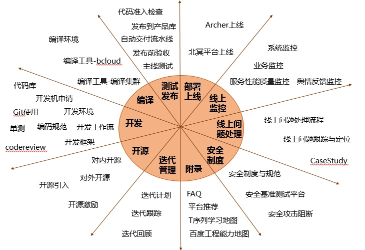

欢迎大家成为百度工程师一员，百度拥有数万名研发工程师，这里聚集着中国乃至全球最为优秀的技术人员。

      这里的工程师有着很强的技术信仰，正如“百度”名字的来源，八百年前南宋词人辛弃疾的一句词：众里寻他千百度。这句话描述了词人对理想的执着追求。百度工程师，一直秉持着技术理想，科技让复杂的世界更简单，是百度的新使命。

 

      百度工程师有自己的信条：

坚信技术改变生活
摒弃屌丝文化（粗制滥造），追求工匠精神
用事实和数据证明自己的观点
永远为自己的代码负责：干净，高效，安全
主动担当，负责到底
追求技术，但不重复造轮子
对线上怀有敬畏之心
承诺必达
做一流人才，高素质，高贡献，高回报
 

      百度工程师持续追求卓越工程能力：

持续基于平台化思维进行技术与业务的创新：积累可复用平台400多个，可复用工具700多个；每天有1000多位工程师在河图上搜索平台用于技术与业务创新，平均每产品使用平台数已超过10个。河图：公司可复用平台和技术门户http://hetu.baidu.com。
持续注重代码质量，遵循《百度编码规范》：百度上万名工程师每天产生90W行代码提交5W多次，代码100%符合百度编码规范要求，经过CodeReview和一系列自动化测试后完成上线。
注重敏捷开发，持续迭代持续交付：基于用户导向随时演进自己的产品和技术架构，快速迭代收集用户反馈，让产品的用户体验和技术能力始终保持最高水平。
先进研发工具平台支撑，实现全流程高效研发：百度提供开发集群、编译集群、测试集群、需求管理、项目管理、持续交付、自动化部署与运维的全套研发工具平台，支撑百度工程师实现最高效的研发过程。
具备安全意识遵循代码安全规范：百度工程师具很强的安全规范和意识，在日常开发、测试、运维、及其他工作中能严格遵守安全红线、安全编码规范、安全配置标准、数据安全、办公安全等一系列安全制度和规范。
 

      本手册目的是希望通过分享百度工程师在日常开发、测试、运维过程中的工作流程和方法，为百度的工程师们提供一个可以更快融入研发工作环境的窗口，能快速了解百度工程师的理想，信念，做事原则以及一些提高研发效率和工程能力的有价值做法和工具平台。

      作为百度的工程师，如果你觉得从本手册内容中得到一些启发、能够对你的平时工作专业能力和效率提升带来一些辅导和帮助，那么本手册就达到了它的目的，也是所有作者的心愿。

      衷心祝愿你能快速融入百度工程师大家庭，在工作中不断取得新的进步!

      百度工程师手册内容导览：

