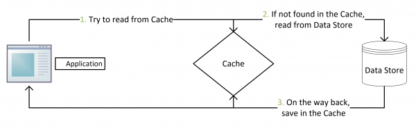

# Web应用开发中的缓存更新的套路及常见的问题分析

# 1. 缓存
缓存是一种提高系统读性能的常见技术， 从cpu的一级和二级缓存、Internet的DNS、到浏览器缓存都可以看做是一种缓存技术。

而在Web应用开发中对于读多写少的应用场景，我们经常使用对应的缓存技术来对读取频繁的数据进行优化，因为取原始数据而频繁I/O操作的代价太大了。

下图所示为一个典型的Web应用的网络架构示例图：

在这样的应用开发中涉及到很多个层级，我们需要针对每一个层级的应用使用特定的缓存技术来提升各自的性能，从而达到系统的最优性能。

在一个Web应用开发中常用的缓存技术在**数据层访问速度**如下，作为开发人员要记住这些量级

在知道了Web应用开发中的缓存技术在各数据层访问速度之后，还需要知道的是什么时候更新缓存。

# 2 缓存更新的时机
缓存更新时机主要分为两类：
>**1. 先淘汰缓存，后更新数据库。**
>**2. 更新数据库，后淘汰缓存。**

## 2.1. 先淘汰缓存，后更新数据库

这样的方式在正常情况下不会有什么问题，如果淘汰缓存成功，更新数据库失败，也仅仅会造成一次缓存没命中，查询数据库后又会将缓存更新，不会有大问题。但是如果在下面的并发情况下：

**存在的问题：**
两个线程，一个是写操作，另一个是读操作，写操作淘汰缓存后，读操作没有命中缓存，先把老数据读出来后放到缓存中，然后写操作更新了数据库。于是，在缓存中的数据还是老的数据，导致缓存中的数据是脏的，而且还一直这样脏下去了。

## 2.2 先更新数据库，后淘汰缓存

另一种方式：一个是读操作，但是没有命中缓存，然后就到数据库中取数据，此时来了一个写操作，写完数据库后，让缓存失效，然后，之前的那个读操作再把老的数据放进去，所以，会造成脏数据。

如下图所示：

**存在的问题：**
这个case理论上会出现，不过，实际上出现的概率可能非常低，因为这个条件需要发生在读缓存时缓存失效，而且并发着有一个写操作。而实际上数据库的写操作会比读操作慢得多，而且还要锁表，而读操作必需在写操作前进入数据库操作，而又要晚于写操作更新缓存，所有的这些条件都具备的概率基本并不大。

>小结

以上两种方案看来都不够完美，都没法做到数据的强一致，如果非要强一致，就得引入分布式事务来保证写数据库和淘汰缓存在一个事务里，这样做性能又会受到影响。

在这里，我们先不讨论更新缓存和更新数据这两个事是一个事务的事，或是会有失败的可能，我们先假设更新数据库和更新缓存都可以成功的情况下，应该使用的**缓存更新的套路**。

# 3 缓存更新的套路

常用的更新缓存套路中主要有四种Design Pattern：`Cache aside, Read through, Write through, Write behind caching`，我们下面一一来看一下这四种Pattern。

>**Cache Aside Pattern**

这是最常用最常用的pattern了。其具体逻辑如下：

* **失效**：应用程序先从cache取数据，没有得到，则从数据库中取数据，成功后，放到缓存中。
* **命中**：应用程序从cache中取数据，取到后返回。
* **更新**：先把数据存到数据库中，成功后，再让缓存失效。

注意，我们的更新是先更新数据库，成功后，让缓存失效。那么，这种方式是否可以没有文章前面提到过的那个**先更新数据库，后淘汰缓存**的问题呢？我们可以分析一下。

一个是查询操作，一个是更新操作的并发，首先，没有了删除cache数据的操作了，而是先更新了数据库中的数据，此时，缓存依然有效，所以，并发的查询操作拿的是没有更新的数据，但是，更新操作马上让缓存的失效了，后续的查询操作再把数据从数据库中拉出来。而不会像文章开头的那个逻辑产生的问题，后续的查询操作一直都在取老的数据。

这是标准的design pattern，包括Facebook的论文[《Scaling Memcache at Facebook》](https://www.usenix.org/system/files/conference/nsdi13/nsdi13-final170_update.pdf)也使用了这个策略。

为什么不是写完数据库后更新缓存？可以看一下Quora上的这个问答[《Why does Facebook use delete to remove the key-value pair in Memcached instead of updating the Memcached during write request to the backend?》](https://www.quora.com/Why-does-Facebook-use-delete-to-remove-the-key-value-pair-in-Memcached-instead-of-updating-the-Memcached-during-write-request-to-the-backend)，主要是怕两个并发的写操作导致脏数据。

那么，是不是**Cache Aside**这个就不会有并发问题了？不是的，比如，一个是读操作，但是没有命中缓存，然后就到数据库中取数据，此时来了一个写操作，写完数据库后，让缓存失效，然后，之前的那个读操作再把老的数据放进去，所以，会造成脏数据。

其中存在的问题和上述 **2.2** 中描述的问题是一样的。

所以，这也就是Quora上的那个答案里说的，要么通过**2PC**或是**Paxos**协议保证一致性，要么就是拼命的降低并发时脏数据的概率，而Facebook使用了这个降低概率的玩法，因为**2PC太慢，而Paxos太复杂**。当然，最好还是为**缓存设置上过期时间**。

>**Read/Write Through Pattern**

我们可以看到，在上面的Cache Aside套路中，我们的应用代码需要维护两个数据存储，**一个是缓存（Cache），一个是数据库（Repository）**。所以，应用程序比较啰嗦。而Read/Write Through套路是把更新数据库（Repository）的操作由缓存自己代理了，所以，对于应用层来说，就简单很多了。可以理解为，**应用认为后端就是一个单一的存储，而存储自己维护自己的Cache。**

>**Read Through**

**Read Through** 套路就是在查询操作中更新缓存，也就是说，当缓存失效的时候（过期或LRU换出），Cache Aside是由调用方负责把数据加载入缓存，而Read Through则用缓存服务自己来加载，从而对应用方是透明的。

>**Write Through**

Write Through 套路和Read Through相仿，不过是在更新数据时发生。当有数据更新的时候，如果没有命中缓存，直接更新数据库，然后返回。如果命中了缓存，则更新缓存，然后再由Cache自己更新数据库（这是一个同步操作）
下图自来Wikipedia的[Cache](https://en.wikipedia.org/wiki/Cache_(computing))词条。其中的Memory可以理解为就是我们例子里的数据库。

>**Write Behind Caching Pattern**

Write Behind 又叫 Write Back。Linux文件系统的Page Cache的算法使用的就是这中模式。

Write Back套路，一句说就是，在更新数据的时候，只更新缓存，不更新数据库，而我们的缓存会异步地批量更新数据库。这个设计的好处就是让数据的I/O操作飞快无比（因为直接操作内存嘛 ），因为异步，write backg还可以合并对同一个数据的多次操作，所以性能的提高是相当可观的。

但是，其带来的问题是，数据不是强一致性的，而且可能会丢失（我们知道Unix/Linux非正常关机会导致数据丢失，就是因为这个事）。在软件设计上，我们基本上不可能做出一个没有缺陷的设计，就像算法设计中的**时间换空间，空间换时间**一个道理，有时候，强一致性和高性能，高可用和高性性是有冲突的。软件设计从来都是取舍权衡。

另外，Write Back实现逻辑比较复杂，因为他需要track有哪数据是被更新了的，需要刷到持久层上。操作系统的write back会在仅当这个cache需要失效的时候，才会被真正持久起来，比如，内存不够了，或是进程退出了等情况，这又叫**lazy write**。

在wikipedia上有一张write back的流程图，基本逻辑如下：

 
>**One More Thing**

1. 以上的Design Pattern，其实并不是软件架构里的mysql数据库和memcache/redis的更新策略，这些东西都是计算机体系结构里的设计，比如CPU的缓存，硬盘文件系统中的缓存，硬盘上的缓存，数据库中的缓存。基本上来说，这些缓存更新的设计模式都是非常老古董的，而且历经长时间考验的策略，所以这也就是，工程学上所谓的Best Practice，遵从就好了。

2. 上面，我们没有考虑缓存（Cache）和持久层（Repository）的整体事务的问题。比如，更新Cache成功，更新数据库失败了怎么吗？或是反过来。关于这个事，如果你需要强一致性，你需要使用“两阶段提交协议”——prepare, commit/rollback，比如Java 7 的XAResource，还有MySQL 5.7的 XA Transaction，有些cache也支持XA，比如EhCache。当然，XA这样的强一致性的玩法会导致性能下降，当然，这又涉及到了分布式系统以及分布式的事务的相关话题，有兴趣的同学可以看看[《分布式系统的事务处理》](https://coolshell.cn/articles/10910.html)一文。

在清楚了缓存更新的常用套路之后，在实际使用缓存技术时，还会遇见哪些坑？应该注意些什么从而避免掉到坑里面呢？下面我们来看一下**缓存操作中常见的问题**。

#4  缓存操作中常见的问题

常见的使用缓存技术存在的问题如以下几类：
1. 缓存一致性
2. 缓存并发
3. 缓存雪崩
4. 缓存击穿

参考图如下：

## 4.1缓存并发

原因：
1. 缓存过期或者在更新 
2. 同时有大量的并发请求该key

描述：
如果网站并发访问高，一个缓存如果失效（在上述条件下），可能出现多个进程同时直接获取DB数据，这时候会对DB造成很大的访问压力。

问题：
比如缓存过期，此时大量请求落到DB上，可能导致“雪崩”发生；如果缓存更新，对某个key有大量的并发请求，此时请求获得的结果可能是更新之前或者更新之后，从而会导致“缓存一致性”的问题出现。

解决策略：
由于“缓存并发”问题一般发生在查询期间，而且问题出在缓存更新时的高并发时刻，思路上，就可以在这个时候，对key加锁。（对缓存查询加锁，如果 KEY 不存在，就加锁，然后查 DB 后写入缓存，然后解锁；） 
   
流程图参考：
   

## 4.2缓存一致性

原因：

1. 当数据时效性要求很高
2. 需要保证缓存中的数据与数据库中的保持一致
3. 而且需要保证缓存节点和副本中的数据也保持一致，不能出现差异现象。（集群同步）

解决方案：
这就比较依赖缓存的过期和更新策略。一般会在数据发生更改的时，主动更新缓存中的数据或者移除对应的缓存。

   

   
##4.3 缓存雪崩

现象：
缓存雪崩就是指由于缓存的原因，导致大量请求到达后端数据库，从而导致数据库崩溃，整个系统崩溃，发生灾难。

原因：

1. 某些原因（根本原因高并发），缓存更新或者过期等导致缓存命中失效。
2. 大量请求直接落到DataBase上面，致其无法承受压力，进而崩溃。（是缓存并发的递进与升级版）
   
解决方案：

1. 设定一个缓存的过期时间时，可能有一些会设置1分钟后或5分钟后。当并发很高时，会出在某一间同时生成了很多的缓存，并且过期时间都一样，这个时候就可能引发一当过期时间到后，这些缓存同时失效，请求全部转发到DB ，DB 可能会压力过重，这样子，我们就可以将缓存过期时间均匀地分布在时间轴上，避免缓存同时失效、更新的情况发生  
2. 制缓存并发、击穿现象的发生，查找大key，想解决方案。
3. 从整个研发体系流程的角度，应该加强压力测试，尽量模拟真实场景，尽早的暴露问题从而防范。

##4.4 缓存击穿

前提：
某个key对应的数据为空（在缓存，db中）

条件：

1. 该key被高并发访问，缓存访问没有命中，尝试去从后端数据库中获取，从而导致了大量请求达到数据库
2. 当该key对应的数据本身就是空的情况下，这就导致数据库中并发的去执行了很多不必要的查询操作，从而导致巨大冲击和压力。
   
   
   
解决方案：

1. 缓存空对象
对查询结果为空的对象也进行缓存，如果是集合，可以缓存一个空的集合（非null），如果是缓存单个对象，可以通过字段标识来区分。这样避免请求穿透到后端数据库。同时，也需要保证缓存数据的时效性。这种方式实现起来成本较低，比较适合命中不高，但可能被频繁更新的数据。
2. 单独过滤处理
对所有可能对应数据为空的key进行统一的存放，并在请求前做拦截，这样避免请求穿透到后端数据库。这种方式实现起来相对复杂，比较适合命中不高，但是更新不频繁的数据。

3. 设置指定值
如果一个查询返回的数据为空（可能由于数据不存在，也可能是系统故障），我们仍然把这个空结果进行缓存，缓存的值设定为一个指定值，同时设置它的过期时间很短，最长不超过五分钟。（因为缓存会占用内存，长时间缓存一个不存在的值比较耗资源。）在这五分钟内，这个值可能由于写入操作从而不再是一个不存在的值，这是就要更新缓存，用真实值替代指定值。

比如，设定不存在的值缓存为 &&，也就是 "key" ===> "&&"。当返回这个 && 值的时候，就可以认为这是不存在的 key，然后决定是继续等待访问，还是放弃掉这次操作。如果继续等待访问，那么经过一个时间轮询点后，再次请求这个 key，如果取到的值不再是 &&，则可以认为这时候 key 有值了，从而避免了透传到数据库，从而把大量的类似请求挡在了缓存之中。

>总结

**观察共同点：**
1.高并发
2.时机：缓存更新、缓存失效居多

**比较：**
1.并发和雪崩
“并发”和“雪崩”都是高并发时候缓存不被命中直接访问DB的例子，但是为什么还会把他们定义为两个常见的问题？我的理解，前者是因，或者是果，“并发”造成的影响还不够恶劣，雪崩会导致数据库直接崩溃。

**关联关系**
“并发”和“击穿”可能会导致“雪崩”发生，参考我的思维导图，避免发生“雪崩”，除了给出的解决方案，更要从流程上提前发现和防止“并发”和“击穿”的发生。

>参考：

1. https://en.wikipedia.org/wiki/Cache_(computing)
2. http://www.cnblogs.com/dinglang/p/6133501.html
3. https://coolshell.cn/articles/17416.html

